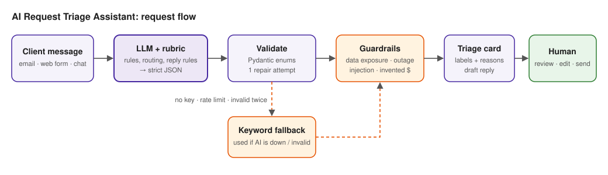

# AI Request Triage Assistant

A working prototype that turns an unstructured client message (email, web form or chat) into a clear next step. In a few seconds it returns:

- a short **summary** and the key details (IDs, deadlines, scale)
- a **category**: Sales, Support, Billing, Technical or Other
- a **priority**: Low, Medium, High or Urgent, **with a reason**
- an **owner**: Sales Team, Client Success, Finance or Engineering
- a **draft first response** that a team member reviews, edits and sends
- **warnings** when a person should look more carefully (data exposure, prompt injection, vague requests, invented prices, low confidence)

> **Live app:** `<add Streamlit Cloud link>` · **Video walkthrough:** `<add video link>`



---

## Quick start

```bash
git clone <repo-url> && cd triage-assistant
python3 -m venv .venv && source .venv/bin/activate
pip install -r requirements-dev.txt
cp .env.example .env        # add a free GEMINI_API_KEY from https://aistudio.google.com/apikey
streamlit run app.py        # opens http://localhost:8501
```

With no API key the app still works in **rules-only mode** (keyword fallback), so reviewers can always run it.

```bash
python eval.py                  # score all 15 test cases with the configured AI
python eval.py --engine rules   # score the keyword fallback
pytest -q                       # 10 unit tests, no network needed
```

---

## How to use it

1. **Triage a request** tab: pick one of the six mock requests (or an edge case), or paste any new message. Choose the channel and press **Triage request**.
2. Read the card:
   - category, priority and owner badges, with the target response time
   - any warnings
   - the summary and why each label was chosen
3. Edit the draft reply, then copy it with the **Copy-ready version** panel.
4. **Inbox queue** tab: shows every request triaged in the session, **most urgent first**, with its owner. **Triage all 6 mock requests** fills it in one click. This is the view a team lead would use so nothing important waits in the wrong inbox.

---

## How it works

```
client text ──► prompt (rubric + routing rules + safety) ──► LLM returns JSON
                                                              │
                        Pydantic validation (enums, types) ◄──┘
                         │ invalid → send the error back, 1 repair attempt
                         │ still invalid / API down / no key → keyword rules fallback
                         ▼
                 safety guardrails (applied to every result)
                         ▼
               Streamlit UI  ──►  human reviews, edits, sends
```

| Step | File | What it does |
|---|---|---|
| Schema | [`triage/schema.py`](triage/schema.py) | Enums for every label, so the UI can never show a category, priority or owner the business didn't define. Tolerant normalisation (`"urgent"` → `Urgent`, `85` → `0.85`). |
| Prompt | [`triage/prompts.py`](triage/prompts.py) | Category definitions, priority rubric, routing table, flag list, reply-writing rules, prompt-injection defence, and the JSON output contract. |
| LLM call | [`triage/llm.py`](triage/llm.py) | Plain HTTPS calls, no SDK lock-in. Gemini (free tier) by default, or any OpenAI-compatible endpoint (Groq, OpenRouter, local Ollama). Friendly errors for rate limits and bad keys. |
| Pipeline | [`triage/pipeline.py`](triage/pipeline.py) | Validate → one repair attempt → fallback → guardrails. Always returns a result. |
| Rules | [`triage/rules.py`](triage/rules.py) | (1) Keyword fallback classifier with template replies. (2) Guardrails that run on *every* result. |
| UI | [`app.py`](app.py) | Streamlit: triage tab + priority-sorted inbox queue. |
| Eval | [`eval.py`](eval.py), [`data/cases.json`](data/cases.json) | 6 mock requests + 9 synthetic edge cases with expected labels and extra checks. |

### The AI logic

**1. Business rules live in the prompt as explicit text.** The model doesn't guess what "Urgent" means; it applies a written rubric:

| Priority | Definition | Target first response |
|---|---|---|
| Urgent | Active outage blocking work; security incident or exposure of personal/customer data; legal risk | 1 hour |
| High | Concrete deadline within days, money at risk, or a significant defect with a workaround | Same business day |
| Medium | Real business need, no immediate harm (sales enquiries, meetings, how-to) | 1 business day |
| Low | Ideas, feedback, nice-to-haves, no deadline | 3 business days |

The prompt also says: *judge priority by business impact, not by tone*. "URGENT!!!" on a logo change is still Low, and a calm message about leaked customer data is still Urgent.

**2. Default routing plus explained exceptions.** Sales → Sales Team, Support → Client Success, Billing → Finance, Technical → Engineering, Other → Client Success. The model may deviate, but it must justify it in `routing_reason`, and the UI flags any deviation for the reviewer. For a message with several issues, it routes to the owner of the most urgent one and flags `multiple_issues`.

**3. Reasons come before labels.** The JSON asks for `category_reason` before `category` and `priority_reason` before `priority`. The model writes its justification first and then commits to a label, which makes the labels more consistent and gives the reviewer a visible "why".

**4. Structured output with a strict contract.** JSON mode is enforced, then Pydantic validates every field against the enums. If the model returns something invalid (e.g. `"priority": "Critical"`), the exact validation error goes back to the model for one repair attempt.

**5. Rules for the reply draft.** Written in the client's language. The draft acknowledges the request, says who is handling it and what happens next, and asks for the specific information the team needs. It **never** invents prices, timelines, refunds or root causes, and uses `[placeholders]` for anything unknown.

**6. Prompt-injection defence.** The client text is wrapped in `<request>` tags and declared to be data. Attempts to escape the tag are neutralised. The model is told to triage the genuine content and flag `suspicious_content`.

**7. Few-shot examples are synthetic.** They are deliberately *different* from the six mock requests, so the evaluation isn't "teaching to the test".

### Hybrid safety layer: why rules and AI together

The LLM handles the judgment: nuance, summaries, tone, other languages. A small deterministic layer ([`rules.py`](triage/rules.py)) guarantees that a few critical cases can't slip through, whatever the model says:

- **Possible data exposure** ("accidentally" + "customer data", "leak", "breach"...) → priority can't be below **Urgent**, and the reviewer is told to involve a security/privacy lead.
- **Outage language** ("unavailable", "cannot access") → priority can't be below **High**.
- **Prompt injection** patterns → flagged for the reviewer.
- **Invented amounts**: if the draft contains a price or amount that isn't in the request, it is flagged before anyone sends it.
- **Low confidence** (< 60%), **vague**, **multiple issues** or **frustrated client** → reviewer warnings.

The same rules also form a **fallback classifier**. If the AI provider is down, rate-limited or not configured, the workflow still produces a labelled, routed ticket with a template reply, clearly marked as "rule-based fallback".

---

## Results on the six mock requests

| # | Request | Category | Priority | Owner | Reasoning |
|---|---|---|---|---|---|
| 01 | 40 staff re-typing data, wants a call next week | Sales | Medium | Sales Team | Clear buying intent, meeting requested next week. Timely, but nothing breaks if the reply comes tomorrow. |
| 02 | Client portal down since morning | Technical | **Urgent** | Engineering | Active outage blocking staff from customer records. |
| 03 | Invoice NS-1048 double charge, pays Friday | Billing | High | Finance | Money at risk with a concrete deadline. Reply promises a review, not a refund. |
| 04 | Dark mode + font, no deadline | Technical | Low | Engineering | Product feature idea, explicitly no deadline. (Client Success is also defensible; the eval accepts both.) |
| 05 | Customer contact data uploaded to wrong workspace | Technical | **Urgent** | Engineering | Possible exposure of personal data. Engineering can revoke access. Flagged for security/privacy review. The reply asks for workspace and file details and advises against further sharing. |
| 06 | New lead asking for pricing and timeline | Sales | Medium | Sales Team | New business enquiry. The reply proposes a discovery call and **does not invent a price**. |

Beyond the six mocks, [`data/cases.json`](data/cases.json) holds 9 synthetic edge cases:

- a vague call-back request
- two issues in one message
- a frustrated repeat complainer
- "URGENT!!!" on a cosmetic change
- a Spanish outage report
- a prompt injection hiding a real API-key leak
- spam
- a one-word message
- an upsell request

Latest reports:
- AI engine: [`results/eval_ai.md`](results/eval_ai.md) (run `python eval.py --out results/eval_ai.md`)
- Rules-only fallback: [`results/eval_rules.md`](results/eval_rules.md): **13/15 cases fully correct, 43/45 labels acceptable**. The two misses are the Spanish outage report and the leaked API keys. Those are exactly where keyword rules break and the LLM earns its place.

---

## Key decisions and trade-offs

| Decision | Why | Trade-off |
|---|---|---|
| **One LLM call with a rubric** instead of an agent chain | Fast (a few seconds), cheap, easy to explain and debug | Less room for multi-step reasoning, which this task doesn't need |
| **Gemini free tier** behind a provider-neutral HTTP layer | The brief says don't spend money; the provider can be swapped by config | Free-tier rate limits, handled by the fallback and a result cache |
| **Enums + validation + repair + fallback** | Functionality must be reliable; the UI never shows an invalid label | Extra code compared with trusting the model |
| **Deterministic guardrails on top of the AI** | For data exposure and outages, a missed escalation costs far more than a false alarm | Keyword floors can over-trigger (e.g. "exposed" used innocently); the reviewer sees why |
| **Human in the loop** | Drafts are suggestions; nothing is sent automatically | A person still spends seconds reviewing |
| **Streamlit** | A clean, working UI in one file, free hosting | Not a production front end; no auth |
| **Synthetic few-shot + separate eval set** | Honest measurement and no overfitting to the six mocks | Needs more labelled data to be statistically meaningful |

## Limitations

- It only sees the message text, with no client history, contract tier or SLA. A VIP's "Medium" might really be "High".
- One owner per request. Multi-issue messages are flagged, not split.
- LLM output can vary slightly between runs, and the free tier has rate limits.
- The fallback replies are English-only templates, and keyword rules miss paraphrases and other languages.
- In production, message text would go to a third-party LLM, so PII should be redacted first (or a self-hosted model used).
- 15 test cases show the approach works but don't prove accuracy at scale.

## What I'd improve next

1. **Connect real intake**: Gmail/Outlook, the web-form webhook and chat, and push triaged tickets into the helpdesk (Zendesk, HubSpot, Jira) with the owner assigned.
2. **Learn from reviewers**: log every label or draft correction and use it as new eval cases and few-shot examples, measuring accuracy over time.
3. **Client context**: look up the client (tier, open incidents, account owner) before triage, so priority and routing reflect the relationship.
4. **SLA timers and escalation**: alert if an Urgent ticket has no response within the hour.
5. **Split multi-issue messages** into separate tickets with their own owners.
6. **PII redaction** before the LLM call, audit logging and role-based access.
7. **A larger labelled dataset** (a few hundred historical tickets), with a confusion matrix per category and priority.

## Project structure

```
app.py                  Streamlit UI
triage/
  schema.py             labels (enums), result model, routing + response-time tables
  prompts.py            system prompt, rubric, user/repair messages
  llm.py                Gemini + OpenAI-compatible providers over HTTPS
  pipeline.py           validate → repair → fallback → guardrails
  rules.py              keyword fallback classifier + safety guardrails
data/cases.json         6 mock requests + 9 synthetic edge cases with expected labels
eval.py                 scoring script (markdown report)
tests/                  unit tests with a fake LLM (no network)
results/                saved eval reports
docs/                   video script, submission checklist, study guide
```

## Data and privacy

Only the six mock requests from the brief and invented edge cases are used. No real client data. API keys live in `.env` / Streamlit secrets and are git-ignored.

## AI use

I used an AI coding assistant while building this. I reviewed every file and can explain each design choice, prompt and line of logic. See [`docs/STUDY_GUIDE.md`](docs/STUDY_GUIDE.md).
